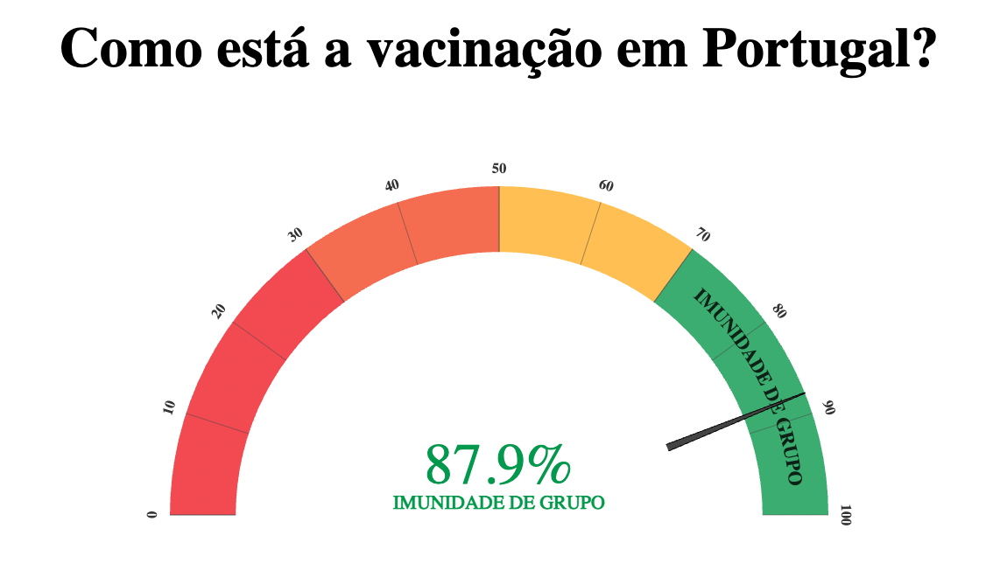

<h1 align="center">Como vai a vacina?</h1>
<h3 align="center">https://calapez.github.io/como-vai-a-vacina/</h3>

"Como vai a vacina?" is a project created by Bruno Ponte. This web app shows the vaccination progress in Portugal.

  

  

  

  

